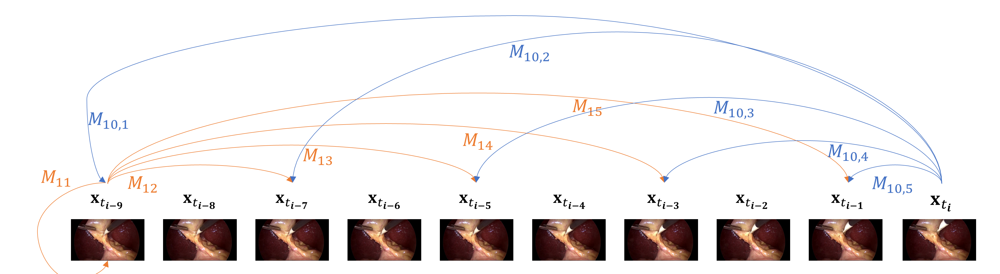

# LRTD: Long-Range Temporal Dependency based Active Learning for Surgical Workflow Recognition
Xueying Shi, Yueming Jin, Qi Dou, and Pheng-Ann Heng
## Introduction
<td></td>


The LRTD repository contains the codes of our LRTD paper. We validate our approach on a large surgical video dataset [Cholec80](http://camma.u-strasbg.fr/datasets) by performing surgical workflow recognition task. By using our LRTD based selection strategy, we can outperform other state-ofthe-art active learning methods who only consider neighbor-frame information. Using only up to **50%** of samples, our approach can exceed the performance of full-data training
## Requirements
- python 3.6.9
- torch 0.4.1
## Usage

1.  download data from [Cholec80](http://camma.u-strasbg.fr/datasets) and then split the data into 25fps using [ffmpeg](https://www.johnvansickle.com/ffmpeg/). 
    ```
    sh split_video_to_image.sh
    ```
2.  Resize the image from 1920 x 1080 to 250 x 250
2.  after creating data, my data folders would like the following structure
    ```
     |
     ├── chorec80 
     |   ├── data_frames(put the raw image frames in this folder)
     |       ├── video01
     |          ├── video01-1.jpg
     |          ├── ...
     |          ├── video01-xxx.jpg
     |       ├── videoxxx
     |       ├── ...
     |       ├── video80
     |   ├── data_resize(put the resized image frames in this folder)	   
     |       ├── video01
     |          ├── video01-1.jpg
     |          ├── ...
     |          ├── video01-xxx.jpg
     |       ├── videoxxx
     |       ├── ...
     |       ├── video80
     |   ├── phase_annotations
     |       ├── video01-phase.txt
     |       ├── ...
     |       ├── video80-phase.txt
     |   ├── tool_annotations
     |       ├── video01-tool.txt
     |       ├── ...
     |       ├── video80-tool.txt
     

     ```
2.  split data into train, val, test data (in our setting, we would downsample from 25fps to 1fps when spliting data)
    ```
    python get_paths_labels.py .
    ```

3.  select partial data to train
- we initialized with randomly selected 10% data from the unlabelled sample pool. The selected data is stored in nonlocalselect_txt folder. Note that the select_chose can be 'DBN'(comparasion method) or 'non_local', for the first 10% data, we all use random selection, from the next selection, we separately use 'DBN' or 'non_local'. So the first 10% data select, we set '--is_first_selection=True' in ./nonlocalselect.sh, and can igore other parameter listed ./nonlocalselect.sh becuase we have set a break point after data selection, your can directly quit the program when meeting the break point, it means that you finished data selection. From 20%-50% data selection, we should comment '--is_first_selection=True'. Moreover, we should change '--val_model_path' to indicate which model as valiation model for the rest of the data. For example, we have already trained a model using 10% data, we use set this mode as validation model to select the next 10% data.
    ```
    ./nonlocalselect.sh to select data. 
    ```

4.  for training of ResLSTM backbone, set '--json_name' to indicate which butch of data you want to use, where json file is store in nonlocalselect_txt folder.
    ```
    ./train_nolocalselect_ResNetLSTM.sh
    ``` 

5.  for training of ResLSTM-Nonlocal backbone, change '--FT_checkpoint' as the previous ResLSTM model stored in results_ResLSTM_Nolocal/roundx/RESLSTM folder.
    ``` 
    ./train_nolocalselect_ResNetLSTM_nolocalFT.sh 
    ``` 

6.  for testing
    ```
    python test_singlenet_phase_+nonlocal.py -c 0 -n model(stored in results_ResLSTM_nolocal/roundx/RESLSTM_NOLOCAL folder)
    ```

## Citation
If the code is helpful for your research, please cite our paper.
```
@inproceedings{shi2020lrtd,
title={LRTD: Long-Range Temporal Dependency based Active Learning for Surgical Workflow Recognition},
author={Xueying Shi, Yueming Jin, Qi Dou, and Pheng-Ann Heng},
year={2020},
booktitle={International Conference on Information Processing in Computer-Assisted Interventions (IPCAI)},
publisher={Springer}
}
```
